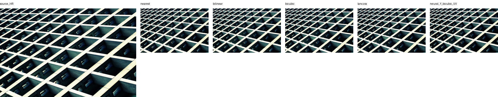

# NN Downscaler

Neural image downscaling experiments.

This project studies learned image downscaling as an information bottleneck. A
model receives a high-resolution image, predicts a lower-resolution
representation, and is trained to preserve information useful for
high-resolution reconstruction.

The current experiment is luma-only. The network predicts the Y channel of a YUV
representation; chroma channels are excluded from the learned model and used
only for RGB visualization.

## Contents

- `nn_downscaler.ipynb`: the main neural-network experiment.
- `downsampling_methods_exploration.ipynb`: earlier exploration of classical
  downsampling methods such as nearest, bilinear, bicubic, and Lanczos.

## Experiment

The model is trained with two objectives:

- predict low-resolution luma matching the LR target;
- reconstruct high-resolution luma from the predicted LR luma.

The decoder receives only the predicted low-resolution luma. It does not receive
hidden encoder features. This ensures that reconstruction depends on the same
bottleneck used as the downscaled output.

The experiment evaluates whether a learned downscaler can preserve useful
structure differently from standard resampling methods such as bicubic or
Lanczos.

## Evaluation

The main numbers are luma losses:

- LR luma loss: how closely the learned downscale matches the LR target;
- HR luma loss: how well the decoder reconstructs the original luma;
- baseline HR loss: how well a simple upsampled LR image reconstructs luma.

RGB previews combine predicted luma with existing chroma channels. They are
relevant for visualization only.

## Results

Native-resolution comparison images are generated from Urban100 HR samples only.
Each source image is downscaled by 2x using nearest, bilinear, bicubic,
Lanczos, and the neural luma model. This avoids comparing against pre-existing
LR files or resizing all samples to a fixed square size.

Generated examples are written to `comparison_outputs/` as side-by-side
comparison images.




## Setup

Install the core dependencies in a Python environment:

```bash
pip install torch torchvision datasets matplotlib numpy pillow notebook
```

Then open the notebooks with Jupyter:

```bash
jupyter notebook
```
