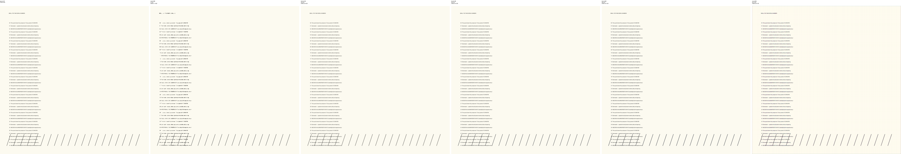

# NN Downscaler

Neural image downscaling experiment: train a network to produce a 2× lower-resolution RGB image that a decoder can reconstruct back to the original. The bottleneck is the learned LR image itself — the decoder receives no encoder feature maps, so reconstruction quality depends entirely on what the encoder chose to preserve.

## Contents

- `train.py` — trains the RGB downscaler on DIV2K and writes checkpoints.
- `compare.py` — generates visual comparisons for classical and neural downsampling, plus round-trip reconstructions.
- `dataset.py` — DIV2K download/path helpers and patch extraction.
- `tensor_cache.py` — memory-mapped tensor pipeline used by the training loop.
- `model.py` — `Downscaler` model definition.

## Architecture

The model has three stages:

- **Encoder** — two convolutions that compress the HR input by 2× spatially (3→16→32 channels).
- **Residual blocks × 4** — refinement at the bottleneck resolution; 92% of the model's 80K parameters live here.
- **LR head** — 1×1 conv that projects 32 features to 3 RGB channels, producing `pred_lr`.
- **Decoder** — a transposed convolution that upscales `pred_lr` back to the original resolution, producing `pred_hr`. Receives only `pred_lr`; no skip connections.

## Training

Trained on [DIV2K](https://data.vision.ee.ethz.ch/cvl/DIV2K/) (800 HR images). Patches are pre-extracted and cached as a memory-mapped tensor to keep the training loop I/O-free. LR targets are generated on-the-fly via bicubic resize.

Loss combines two MSE terms with equal weight:

- **LR loss** — keeps `pred_lr` anchored to the bicubic distribution, preventing steganographic encoding tricks.
- **HR loss** — rewards faithful reconstruction of the original from `pred_lr`.

Optimised with AdamW and ReduceLROnPlateau over 50 epochs.

## Usage

```bash
pip install torch torchvision matplotlib numpy pillow notebook tqdm
```

```bash
python train.py [--n-residual-blocks N] [--batch-size N] [--epochs N] [--checkpoint path.pth]
```

```bash
python compare.py --model path/to/model.pth
```

`compare.py` reads from `test_inputs/`, writes to `comparison_outputs/`, and processes up to 10 images by default. Use `--crop-size N` for a centred crop or `--max-samples 0` for all inputs.

## Results

Two grids are produced per sample:

- **Downscaling** (`sample_NNN_comparison.png`) — HR source alongside LR outputs from nearest, bilinear, bicubic, Lanczos, and the neural encoder.
- **Round-trip** (`sample_NNN_roundtrip.png`) — each method downscales and upscales with the same filter; the neural method uses encoder→decoder end-to-end. PSNR is measured against the original HR.

Round-trip results across 10 test images (1536×1536 → 768×768 → 1536×1536):

| Method | Mean PSNR |
|---|---|
| nearest ↓↑ | 19.70 dB |
| bilinear ↓↑ | 20.98 dB |
| **neural ↓↑** | **21.18 dB** |
| bicubic ↓↑ | 22.56 dB |
| lanczos ↓↑ | 23.03 dB |

The neural pipeline outperforms nearest and bilinear end-to-end. On natural aperiodic content it approaches bicubic; on high-frequency periodic patterns (moiré, checkerboard) classical anti-aliasing filters retain an advantage.




## Future Directions

- Larger decoder (currently only 1.2K parameters — the main capacity bottleneck).
- Perceptual or adversarial HR loss to push beyond MSE-blurry reconstructions.
- Relaxing the LR loss from pixel-MSE to a perceptual constraint, giving the encoder more freedom.
- Tuning the LR/HR loss weight balance.
- Frequency-domain supervision to improve high-frequency pattern handling.
